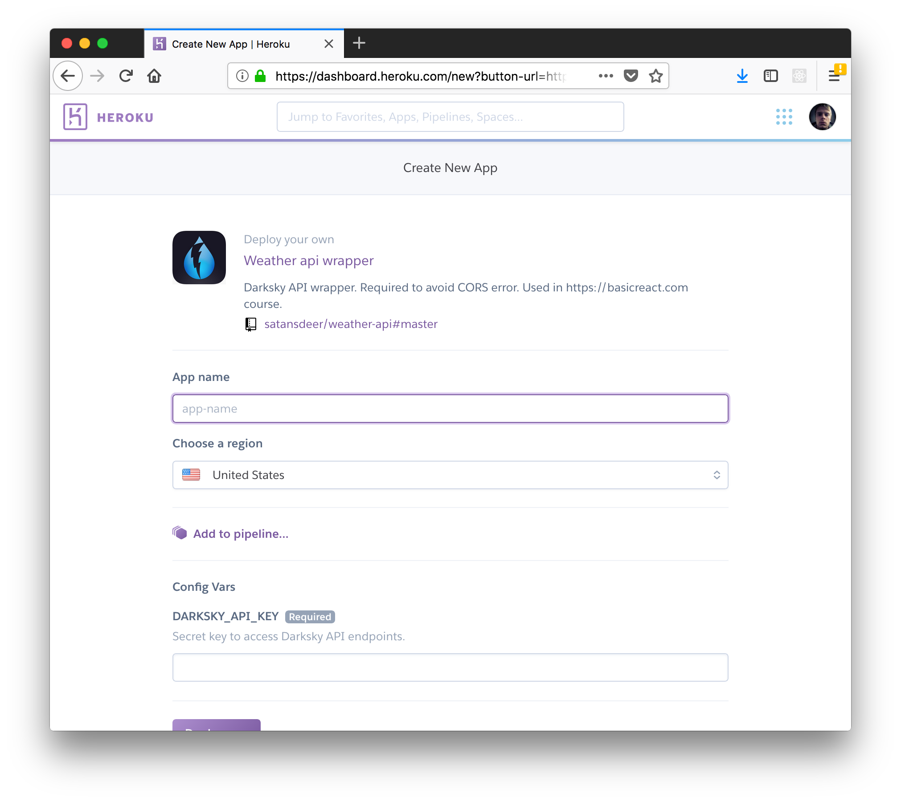

# Darksky API Wrapper

They take security very seriously at Dark Sky. As a security precaution they have disabled cross-origin resource sharing (CORS) on their servers.

This is small and simple wrapper to make calls to Darksky API.

## How To Use

First you have to register on [darksky.net](https://darksky.net) and get an API key. Next register on [heroku.com](https://heroku.com). After that just press the Deploy To Heroku button above.

You'll be prompted with app creation screen.

Enter your app name and API key you got from Darksky. Click the __Deploy app__ button.

Now you can click the __View__ button and go to your app url.

To get forecast you need to provide latitude and longitude:

`<your-app-url>/forecast/<latitude>,<longitude>`

You should get `JSON` response with forecast.
